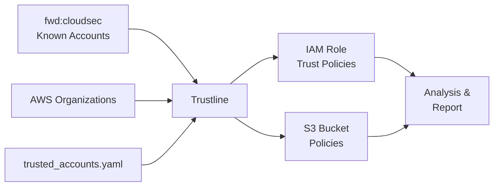

# AWS Trustline

> Map and audit third-party trust relationships in your AWS account.

AWS Trustline analyzes IAM Role trust policies and S3 bucket policies to identify who has access to your AWS resources. It cross-references AWS account IDs found in these policies against a community-maintained list of [known AWS accounts](https://github.com/fwdcloudsec/known_aws_accounts) from [fwd:cloudsec](https://fwdcloudsec.org/) to automatically identify the vendors behind those accounts.

## Features

- **IAM Role Trust Analysis** -- Identifies who can assume roles in your account (trusted internal accounts, known vendors, unknown external accounts)
- **S3 Bucket Policy Analysis** -- Identifies who has cross-account access to your S3 data
- **Vendor Identification** -- Matches account IDs against 500+ known AWS vendor accounts
- **Confused Deputy Detection** -- Flags IAM roles missing the `ExternalId` condition on cross-account trust
- **AWS Organizations Support** -- Automatically fetches your org accounts as trusted entities
- **Custom Trusted Accounts** -- Define your own trusted accounts via YAML configuration
- **Markdown Reports** -- Generates shareable reports for your security team
- **CLI Flexibility** -- Supports AWS profiles, regions, selective analysis, and custom output paths

## How It Works



1. **Gather reference data** -- fetches the latest known AWS vendor accounts from fwd:cloudsec, your AWS Organization members, and any locally defined trusted accounts
2. **Scan policies** -- reads all IAM role trust policies and S3 bucket policies in the target account
3. **Classify access** -- categorizes every external account ID as _trusted_, _known vendor_, or _unknown_
4. **Detect vulnerabilities** -- flags cross-account roles missing the `ExternalId` condition (confused deputy risk)
5. **Report** -- displays results in the console and writes a markdown report

## Quick Start

```bash
git clone https://github.com/zoph-io/aws-trustline.git
cd aws-trustline
pip install -r requirements.txt
python trustline.py
```

## Installation

1. Clone this repository:

   ```bash
   git clone https://github.com/zoph-io/aws-trustline.git
   cd aws-trustline
   ```

2. Install dependencies:

   ```bash
   pip install -r requirements.txt
   ```

3. Configure AWS credentials (if not already done):

   ```bash
   aws configure
   ```

   Or use environment variables:

   ```bash
   export AWS_ACCESS_KEY_ID="your-access-key"
   export AWS_SECRET_ACCESS_KEY="your-secret-key"
   export AWS_DEFAULT_REGION="your-region"
   ```

## Usage

```bash
# Basic usage (analyzes IAM roles and S3 buckets)
python trustline.py

# Use a specific AWS profile
python trustline.py --profile production

# Skip S3 analysis (IAM roles only)
python trustline.py --skip-s3

# Custom output directory and trusted accounts file
python trustline.py --output /tmp/reports --trusted-accounts my-accounts.yaml

# Show version
python trustline.py --version

# Full options
python trustline.py --help
```

### CLI Options

| Option | Short | Description |
|--------|-------|-------------|
| `--profile` | `-p` | AWS profile name |
| `--region` | `-r` | AWS region override |
| `--output` | `-o` | Output directory for reports (default: `.`) |
| `--trusted-accounts` | `-t` | Path to trusted accounts YAML (default: `trusted_accounts.yaml`) |
| `--skip-iam` | | Skip IAM role trust policy analysis |
| `--skip-s3` | | Skip S3 bucket policy analysis |
| `--verbose` | | Show full error tracebacks |
| `--version` | `-V` | Print version and exit |

## Required AWS Permissions

Your AWS user or role needs the following permissions:

```json
{
  "Version": "2012-10-17",
  "Statement": [
    {
      "Effect": "Allow",
      "Action": ["iam:ListRoles", "iam:GetRole", "iam:ListAccountAliases"],
      "Resource": "*"
    },
    {
      "Effect": "Allow",
      "Action": ["s3:ListAllMyBuckets", "s3:GetBucketPolicy"],
      "Resource": "*"
    },
    {
      "Effect": "Allow",
      "Action": ["sts:GetCallerIdentity"],
      "Resource": "*"
    },
    {
      "Effect": "Allow",
      "Action": ["organizations:ListAccounts"],
      "Resource": "*"
    }
  ]
}
```

Or use existing AWS managed policies:

- `IAMReadOnlyAccess` -- IAM role analysis
- `AmazonS3ReadOnlyAccess` -- S3 bucket policy analysis
- `AWSOrganizationsReadOnlyAccess` -- Organization account listing

The Organizations permission is optional; if unavailable, only the YAML-configured trusted accounts will be used.

## Trusted Accounts Configuration

Define your own trusted AWS accounts to distinguish internal accounts from external vendors.

1. Copy the sample file:

   ```bash
   cp trusted_accounts.yaml.sample trusted_accounts.yaml
   ```

2. Edit with your organization's accounts:

   ```yaml
   - name: "My Company Production"
     description: "Production AWS accounts"
     accounts:
       - "123456789012"
       - "234567890123"

   - name: "My Company Development"
     description: "Development AWS accounts"
     accounts:
       - "345678901234"
   ```

If `trusted_accounts.yaml` does not exist, the tool relies solely on AWS Organizations data (if accessible).

## Security Checks

### Confused Deputy Detection

The tool checks whether IAM roles with cross-account access include an `ExternalId` condition. The [confused deputy problem](https://docs.aws.amazon.com/IAM/latest/UserGuide/confused-deputy.html) occurs when a third-party service is tricked into misusing its access to act on behalf of another account. Roles that allow external `AssumeRole` without an `ExternalId` condition are flagged as vulnerable.

## Sample Output

```
╭──────────────────── AWS Trustline ────────────────────╮
│ AWS Trustline                                         │
│ Map and audit third-party trust relationships in your │
│ AWS account.                                          │
╰───────────────────────────────────────────────────────╯

Fetching reference data of known AWS accounts...
Found 480 known AWS accounts in the reference data
Loading trusted AWS accounts...
Found 12 accounts in AWS Organization

Analyzing AWS Account: 123456789012 (my-company-dev)

╭─ Known Vendors with IAM Role Access ─╮
│ Vendor   │ IAM Roles                  │
│──────────┼────────────────────────────│
│ Datadog  │ DatadogIntegrationRole     │
╰──────────────────────────────────────╯

╭── IAM Roles Missing ExternalId Condition ──╮
│ Entity   │ Source │ Vulnerable IAM Roles    │
│──────────┼────────┼─────────────────────────│
│ Datadog  │ vendor │ DatadogIntegrationRole  │
╰────────────────────────────────────────────╯

╭────────── AWS Trustline Results ──────────╮
│ Summary:                                  │
│ Trusted entities found: 1                 │
│ Known vendors found: 1                    │
│ Unknown AWS accounts found: 0             │
│ Vulnerable IAM roles (missing ExternalId) │
╰───────────────────────────────────────────╯

Report generated: trustline_report_123456789012_20250425_123045.md
```

## Contributing

Contributions are welcome! If you know of additional AWS account IDs that should be added to the vendor reference data, please also contribute to the [fwd:cloudsec known_aws_accounts](https://github.com/fwdcloudsec/known_aws_accounts) repository.

## License

This project is licensed under the [MIT License](LICENSE.md).
