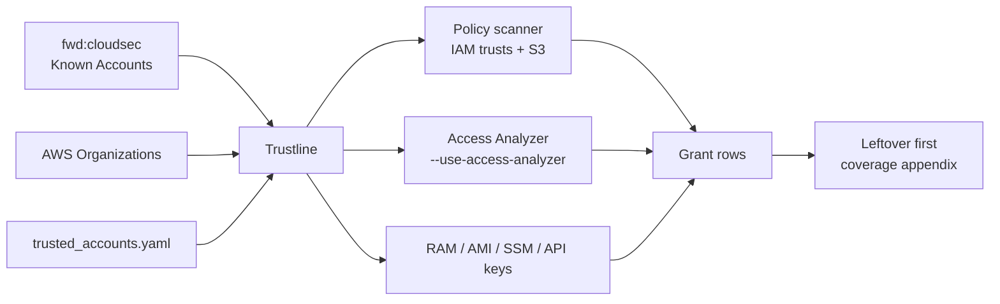

# AWS Trustline

> Map external access grants in your AWS account. Name the vendor when the account is known. Say what you did not scan.

AWS Trustline expands sharing records into **grant rows** (one resource × one principal × one mechanism) and classifies each row against a community-maintained list of [known AWS accounts](https://github.com/fwdcloudsec/known_aws_accounts) from [fwd:cloudsec](https://fwdcloudsec.org/). Unknown leftover is the work list. Coverage of what was **not** scanned lives in an appendix, so a green leftover list is not mistaken for “we looked at everything AWS can share.”

## Features

- **Grant rows**: one resource giving access to one principal, tagged with the mechanism (trust policy, bucket policy, RAM share, AMI launch permission, SSM document share, service-specific credential, or Access Analyzer finding).
- **Two analysis backends** for IAM/S3-class resources:
  - **Policy scanner (default)**: reads IAM role trust policies and S3 bucket policies directly. Walks `Principal.AWS`, `Principal.Federated`, and `Principal: "*"`. Never treats the account ID in an OIDC provider ARN as the external party.
  - **Access Analyzer backend (`--use-access-analyzer`)**: consumes findings from AWS IAM Access Analyzer (external access, **free tier**) for the 15 AA-supported types. Analyzer status `ACTIVE` is not scan-complete; pass `--wait-for-analyzer` to poll until finding counts stabilize.
- **RAM, AMI, SSM, credentials** (both backends unless skipped): Resource Access Manager shares, AMI launch permissions (an `OrganizationArn` is not assumed internal), SSM document shares, and IAM service-specific credentials / long-lived API keys (Bedrock, CloudWatch, CodeCommit, Keyspaces, Claude Platform).
- **Classification**: _trusted_ (org + YAML + CloudFront OAI/OAC), _known vendor_ (fwd:cloudsec + AWS aliases such as Redshift Support), _federated_ (GitHub Actions OIDC, GitLab, SAML, Cognito), _public_, _unknown_.
- **Confused deputy**: missing `sts:ExternalId` on cross-account role trusts, and missing `sub`/`aud` on GitHub/GitLab OIDC trusts.
- **Coverage appendix**: HTML/Markdown reports end with what was scanned and what was not (including Lake Formation, Kafka ACLs, and the AA 15-type ceiling). A regional collector that times out is **not scanned**, not a successful empty result. Leftover tables come first.
- **Account or Organization scope** for Access Analyzer: `--scope account` or `--scope organization`.
- **Multi-region**: `--regions us-east-1,eu-west-1` or `--all-regions` (RAM, AMI, SSM, and AA are regional).
- **HTML and Markdown reports**: self-contained HTML (no JS) in the [iamtrail.com](https://iamtrail.com) design system. Empty leftover sections are omitted (same as the console).

## How It Works


```mermaid
flowchart LR
    A["fwd:cloudsec<br/>Known Accounts"] --> D[Trustline]
    B[AWS Organizations] --> D
    C[trusted_accounts.yaml] --> D
    D --> P["Policy scanner<br/>IAM trusts + S3"]
    D --> AA["Access Analyzer<br/>--use-access-analyzer"]
    D --> X["RAM / AMI / SSM / API keys"]
    P --> G["Grant rows"]
    AA --> G
    X --> G
    G --> R["Leftover first<br/>coverage appendix"]
```

1. **Gather reference data**: fwd:cloudsec vendor accounts, AWS Organization members (and org ID), YAML trusted accounts.
2. **Collect grants** from the selected scanners. Each Allow principal becomes its own row.
3. **Classify**: trusted / vendor / federated / public / unknown. CloudFront OAI/OAC (`iam::cloudfront:user/…`) is trusted AWS, not leftover. Flag missing ExternalId and OIDC `sub`/`aud`. Flag never-expiring service-specific credentials.
4. **Report**: console + HTML/Markdown, led by leftover and KPIs. Coverage is an appendix (collapsed on HTML).

## Quick Start

```bash
git clone https://github.com/zoph-io/aws-trustline.git
cd aws-trustline
pip install -r requirements.txt
python trustline.py
```

## Installation

1. Clone this repository:

   ```bash
   git clone https://github.com/zoph-io/aws-trustline.git
   cd aws-trustline
   ```

2. Install dependencies:

   ```bash
   pip install -r requirements.txt
   ```

3. Authenticate to AWS using **short-lived credentials**. Trustline uses the
   standard boto3 credential provider chain, so anything that produces
   temporary credentials in your shell will work. Recommended options:

   - **IAM Identity Center (AWS SSO)** via a named profile:

     ```bash
     aws configure sso
     aws sso login --profile my-profile
     python trustline.py --profile my-profile
     ```

   - **`aws-vault`** wrapping any role-based or SSO profile:

     ```bash
     aws-vault exec my-profile -- python trustline.py
     ```

   - **An assumed IAM role** (instance profile, EKS Pod Identity, GitHub
     OIDC, etc.) when running inside AWS or from CI.

   Avoid long-lived IAM user access keys. If you must use them temporarily,
   prefer scoped, short-rotation credentials and never commit them to disk.

## Usage

### Policy scanner (default)

```bash
# IAM trusts, S3 policies, RAM, AMI, SSM, service-specific credentials
# (regional collectors use the session region unless you pass --all-regions)
python trustline.py

# Every enabled region for RAM / AMI / SSM
python trustline.py --all-regions --format both

# Skip the slower regional collectors
python trustline.py --skip-ram --skip-ami --skip-ssm
```

### Access Analyzer backend

Consumes findings from an **existing** external IAM Access Analyzer (external-access analyzers are free; see [Cost](#cost)). The tool will not create analyzers for you. If none exists in the requested scope/regions it prints the `aws accessanalyzer create-analyzer` command to run.

```bash
# Current account, current region, wait until finding counts stabilize
python trustline.py --use-access-analyzer --wait-for-analyzer

# Org-wide (run from the management or AA delegated-admin account), all regions
python trustline.py --use-access-analyzer --scope organization --all-regions

# Specific regions, account scope, emit both HTML and Markdown
python trustline.py --use-access-analyzer --regions us-east-1,eu-west-1 \
    --scope account --format both --output ./reports

# Auto-detect (prefers an ORGANIZATION analyzer if present)
python trustline.py --use-access-analyzer --scope auto
```

RAM, AMI, SSM, and service-specific credentials still run alongside Access Analyzer unless you pass the matching `--skip-*` flags.

When `--scope organization` is used, findings are grouped and labeled by `resourceOwnerAccount` using the names from AWS Organizations.

### CLI Options

| Option | Short | Description |
|--------|-------|-------------|
| `--profile` | `-p` | AWS profile name |
| `--region` | `-r` | AWS region override for the session |
| `--output` | `-o` | Output directory for reports (default: `reports/`; each run writes a timestamped file, never overwriting) |
| `--trusted-accounts` | `-t` | Path to trusted accounts YAML (default: `trusted_accounts.yaml`) |
| `--skip-iam` | | Skip IAM role trust policy analysis (policy scanner only) |
| `--skip-s3` | | Skip S3 bucket policy analysis (policy scanner only) |
| `--skip-ram` | | Skip RAM resource shares |
| `--skip-ami` | | Skip AMI launch permissions |
| `--skip-ssm` | | Skip SSM document shares |
| `--skip-credentials` | | Skip IAM service-specific credentials / long-lived API keys |
| `--use-access-analyzer` | | Use IAM Access Analyzer findings instead of the IAM/S3 policy scanner |
| `--wait-for-analyzer` | | Poll AA until ACTIVE finding counts stabilize (`ACTIVE` ≠ scan finished) |
| `--wait-timeout` | | Seconds to wait (default: 300) |
| `--scope` | | `auto` (default), `account`, or `organization` |
| `--regions` | | Comma-separated regions for RAM/AMI/SSM/AA |
| `--all-regions` | | Query every enabled region (enumerated via `ec2:DescribeRegions`) |
| `--format` | | `html` (AA default), `md` (policy-scanner default), or `both` |
| `--verbose` | | Show full error tracebacks |
| `--version` | `-V` | Print version and exit |

### Cost

The **external access analyzer is free**. There is no per-resource or per-region charge for the `--use-access-analyzer` mode. AWS bills only for the *unused-access* and *internal-access* analyzer types, which Trustline does not use.

## Required AWS Permissions

### Policy scanner backend (default)

```json
{
  "Version": "2012-10-17",
  "Statement": [
    {
      "Effect": "Allow",
      "Action": [
        "iam:ListRoles",
        "iam:GetRole",
        "iam:ListAccountAliases",
        "iam:ListServiceSpecificCredentials"
      ],
      "Resource": "*"
    },
    {
      "Effect": "Allow",
      "Action": ["s3:ListAllMyBuckets", "s3:GetBucketPolicy"],
      "Resource": "*"
    },
    {
      "Effect": "Allow",
      "Action": [
        "ram:GetResourceShareAssociations",
        "ram:ListResourceSharePermissions",
        "ram:GetPermission"
      ],
      "Resource": "*"
    },
    {
      "Effect": "Allow",
      "Action": ["ec2:DescribeRegions", "ec2:DescribeImages", "ec2:DescribeImageAttribute"],
      "Resource": "*"
    },
    {
      "Effect": "Allow",
      "Action": ["ssm:ListDocuments", "ssm:DescribeDocumentPermission"],
      "Resource": "*"
    },
    {
      "Effect": "Allow",
      "Action": ["sts:GetCallerIdentity"],
      "Resource": "*"
    },
    {
      "Effect": "Allow",
      "Action": ["organizations:ListAccounts", "organizations:DescribeOrganization"],
      "Resource": "*"
    }
  ]
}
```

Or use existing AWS managed policies plus the RAM/SSM/EC2 image actions above:

- `IAMReadOnlyAccess` (roles and service-specific credentials)
- `AmazonS3ReadOnlyAccess` (S3 bucket policies)
- `AWSOrganizationsReadOnlyAccess` (organization members and org ID)

Organizations permissions are optional; if unavailable, only the YAML-configured trusted accounts will be used, and organization ARNs on AMIs/RAM shares will not be recognized as “this org.”

### Access Analyzer backend (`--use-access-analyzer`)

Add:

```json
{
  "Version": "2012-10-17",
  "Statement": [
    {
      "Effect": "Allow",
      "Action": [
        "access-analyzer:ListAnalyzers",
        "access-analyzer:ListFindings",
        "access-analyzer:GetFinding"
      ],
      "Resource": "*"
    }
  ]
}
```

`ec2:DescribeRegions` is needed for `--all-regions`. For `--scope organization`, the caller must be in the AWS Organizations management account or the IAM Access Analyzer delegated-admin account.

## Trusted Accounts Configuration

Define your own trusted AWS accounts to distinguish internal accounts from external vendors.

1. Copy the sample file:

   ```bash
   cp trusted_accounts.yaml.sample trusted_accounts.yaml
   ```

2. Edit with your organization's accounts:

   ```yaml
   - name: "My Company Production"
     description: "Production AWS accounts"
     accounts:
       - "123456789012"
       - "234567890123"

   - name: "My Company Development"
     description: "Development AWS accounts"
     accounts:
       - "345678901234"
   ```

If `trusted_accounts.yaml` does not exist, the tool relies solely on AWS Organizations data (if accessible). **Member accounts cannot list the org** — copy the sample and list sibling account IDs, or those trusts land on the unknown work list.

YAML names win over fwd:cloudsec vendor aliases for the same account ID (so your own prod account is trusted, not a “vendor”).

## Security Checks

### Confused deputy (`sts:ExternalId`)

Cross-account role trusts without `sts:ExternalId` are flagged per grant (per statement), not per role. **Not flagged:** principals already classified trusted (org/YAML/CloudFront), and AWS org bootstrap roles (`OrganizationAccountAccessRole`, `stacksets-exec-*`, Control Tower execution). Vendors without ExternalId still are — that is the Datadog-shaped case.

### OIDC subject / audience

GitHub Actions OIDC trusts missing `token.actions.githubusercontent.com:sub` or `:aud`, and GitLab OIDC trusts missing `sub`, are flagged. The account ID in the OIDC provider ARN is **not** treated as the external party.

### Public access

`Principal: "*"` / AMI `Group=all` / SSM `AccountIds=all` become public grants. Access Analyzer additionally respects Block Public Access and Deny when you use `--use-access-analyzer`.

### Never-expiring service-specific credentials

Active IAM service-specific credentials with no expiration (Bedrock / CloudWatch API keys default to this on the CLI) are listed as leftover.

### Coverage appendix

Reports **end** with scanned surfaces and explicitly out-of-scope items (Lake Formation, Kafka ACLs, copies, …). HTML keeps that block collapsed. A green leftover list only covers what was scanned.

## Choosing a backend

| Aspect | Policy scanner (default) | Access Analyzer (`--use-access-analyzer`) |
|---|---|---|
| Setup | None, runs immediately | Requires an existing external analyzer (free); will instruct you how to create one |
| IAM / S3-class coverage | IAM role trusts + S3 bucket policies | All [AA-supported types](https://docs.aws.amazon.com/IAM/latest/UserGuide/access-analyzer-resources.html) (15 types) |
| RAM / AMI / SSM / API keys | Yes (unless `--skip-*`) | Yes (unless `--skip-*`) |
| Cross-account accuracy | Allow-principal matching (ignores Deny / BPA) | Provable reasoning (Deny, conditions, BPA, org zone-of-trust) |
| Federated principals | Yes (own section) | Yes (own section; not mixed into unknown) |
| Public detection | Wildcards / `all` groups | AA `isPublic` plus the same extra scanners |
| Freshness | Live API calls | Cached findings; `--wait-for-analyzer` polls until counts stabilize |
| Cost | Free | Free (external-access analyzers are no-charge) |

A few things to know about Access Analyzer:

- **`ACTIVE` is not scan-complete.** There is no API field that says the first scan finished. Use `--wait-for-analyzer` (default timeout 300s). First scans can take ~20 minutes.
- **The 15-type ceiling is printed in the coverage appendix.** AA does not cover RAM shares, AMI launch permissions, or SSM document shares; Trustline scans those separately.
- **Lambda aliases/versions and service principals** are AA exclusions and stay in the not-scanned list.
- **Organization-scope analyzers** treat sibling org accounts as in-zone-of-trust, so they will not show up as AA findings.

## Sample Output

```
╭──────────────────── AWS Trustline ────────────────────╮
│ AWS Trustline                                         │
│ Map external access grants and name the vendor when   │
│ the account is known.                                 │
╰───────────────────────────────────────────────────────╯

Fetching reference data of known AWS accounts...
Found 480 known AWS accounts in the reference data
Loading trusted AWS accounts...
Found 12 accounts in AWS Organization

╭────────── Public access (1) ──────────╮
│ bucket-public │ Everyone (*) │ S3 bucket policy │ public │
╰───────────────────────────────────────╯

╭────────── AWS Trustline Results ──────────╮
│ Trusted: 1                                │
│ Known vendors: 1                          │
│ Federated: 2                              │
│ Unknown: 0                                │
│ Public: 1                                 │
│ Missing ExternalId: 1                     │
│ OIDC missing sub/aud: 0                   │
│ Never-expiring credentials: 0             │
╰───────────────────────────────────────────╯

╭─ Coverage ─╮
│ Scanned: IAM role trust policies, S3 bucket policies, │
│ RAM resource shares, AMI launch permissions, …        │
╰───────────────────────────────────────────────────────╯

Report generated: trustline_report_123456789012_20260901_123045.md
```

## Scheduled scanning on AWS

To run Trustline on a schedule as an AWS Lambda (EventBridge cron, S3-stored
HTML reports, optional SNS alerts on findings), see
[`iac/README.md`](iac/README.md). The IaC is a SAM template deployable with
`sam build && sam deploy --guided`.

## Contributing

Contributions are welcome! If you know of additional AWS account IDs that should be added to the vendor reference data, please also contribute to the [fwd:cloudsec known_aws_accounts](https://github.com/fwdcloudsec/known_aws_accounts) repository.

## License

Licensed under the [Apache License 2.0](LICENSE). See [NOTICE](NOTICE) for
required attribution when redistributing.

Copyright 2025-2026 Victor Grenu / zoph.io.
