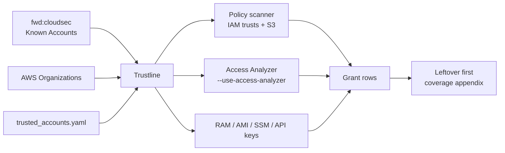

# AWS Trustline

> Map leftover external access in an AWS account. Name the vendor when the account is known. Say what you did not scan.

Trustline expands sharing records into **grant rows** — one resource × one principal × one mechanism — and classifies each row against [fwd:cloudsec known AWS accounts](https://github.com/fwdcloudsec/known_aws_accounts). **Unknown leftover is the work list.** Coverage of what was **not** scanned lives in an appendix, so a green leftover list is not “we looked at everything AWS can share.”

## How to read a report

Each row is one Allow. Empty leftover sections are omitted.

| Label | Meaning |
|---|---|
| **public** | Shared with everyone (`*` or `all`) |
| **unknown** | An AWS account you have not named — start here |
| **federated** | GitHub Actions, GitLab, SAML, or Cognito — not a 12-digit account |
| **vendor** | Named in fwd:cloudsec (plus AWS aliases such as Redshift Support) |
| **trusted** | Your Organization, your YAML file, or CloudFront OAI/OAC |

Tables are always in this order: **public → unknown → OIDC missing `sub`/`aud` → missing ExternalId → never-expiring keys → federated** (GitHub/GitLab first, Cognito last) **→ vendors → trusted**.

HTML and Markdown include the trusted table. The console skips it. Coverage is last (collapsed on HTML). A regional collector that times out is **not scanned**, not an empty success.

## Quick start

```bash
git clone https://github.com/zoph-io/aws-trustline.git
cd aws-trustline
pip install -r requirements.txt

# Short-lived credentials (IAM Identity Center, aws-vault, or an assumed role)
aws sso login --profile my-profile
python trustline.py --profile my-profile
```

Trustline uses the standard boto3 credential chain. Prefer IAM Identity Center, `aws-vault exec my-profile -- python trustline.py`, or a runtime role. Avoid long-lived access keys.

Member accounts cannot call `organizations:ListAccounts`. Copy the sample and list sibling account IDs, or those trusts land on **unknown**:

```bash
cp trusted_accounts.yaml.sample trusted_accounts.yaml
```

## Sample output

Policy scanner, Markdown report. Account IDs and names below are placeholders.

```
╭──────────────────── AWS Trustline ────────────────────╮
│ AWS Trustline                                         │
│ Map external access grants and name the vendor when   │
│ the account is known.                                 │
│ Backend: Policy scanner    Output: md                 │
╰───────────────────────────────────────────────────────╯

Fetching reference data of known AWS accounts...
Found 480 known AWS accounts in the reference data
Loading trusted AWS accounts...
Found 12 accounts in AWS Organization
Loaded 3 trusted AWS accounts from YAML file

Analyzing: 123456789012 (example-alias)

╭────────── Public access (1) ──────────╮
│ example-bucket │ Everyone (*) │ S3 bucket policy │ public │
╰───────────────────────────────────────╯

╭────────── OIDC missing sub/aud (1) ──────────╮
│ ExampleGithubRole │ GitHub Actions │ IAM role trust policy │ federated │
╰──────────────────────────────────────────────╯

╭────────── AWS Trustline Results ──────────╮
│ Trusted: 4                                │
│ Known vendors: 1                          │
│ Federated: 2                              │
│ Unknown: 0                                │
│ Public: 1                                 │
│ Missing ExternalId: 0                     │
│ OIDC missing sub/aud: 1                   │
│ Never-expiring credentials: 0             │
│ Total grants: 8                           │
╰───────────────────────────────────────────╯

╭─ Coverage ─╮
│ Scanned: IAM role trust policies, S3 bucket policies, │
│ RAM resource shares, AMI launch permissions, …        │
│ Not scanned: N surfaces (see report appendix).        │
╰───────────────────────────────────────────────────────╯

Markdown report: reports/trustline_report_123456789012_20260903_090000.md
```

## How it works


```mermaid
flowchart LR
    A["fwd:cloudsec<br/>Known Accounts"] --> D[Trustline]
    B[AWS Organizations] --> D
    C[trusted_accounts.yaml] --> D
    D --> P["Policy scanner<br/>IAM trusts + S3"]
    D --> AA["Access Analyzer<br/>--use-access-analyzer"]
    D --> X["RAM / AMI / SSM / API keys"]
    P --> G["Grant rows"]
    AA --> G
    X --> G
    G --> R["Leftover first<br/>coverage appendix"]
```

1. Load vendor IDs (fwd:cloudsec), Organization members and org ID (if allowed), and YAML trusted accounts.
2. Collect grants. Each Allow principal is its own row.
3. Classify: trusted / vendor / federated / public / unknown. CloudFront OAI/OAC (`iam::cloudfront:user/…`) is trusted AWS. Flag missing ExternalId, GitHub/GitLab `sub`/`aud`, and never-expiring service-specific credentials.
4. Print leftover and KPIs. Coverage is an appendix.

Mechanisms: trust policy, S3 bucket policy, RAM share, AMI launch permission, SSM document share, service-specific credential, or Access Analyzer finding.

## Usage

### Policy scanner (default)

Reads IAM role trust policies and S3 bucket policies (`Principal.AWS`, `Principal.Federated`, `Principal: "*"`). Never treats the account ID in an OIDC provider ARN as the external party. RAM, AMI, SSM, and service-specific credentials run too unless skipped.

```bash
python trustline.py

# Every enabled region for RAM / AMI / SSM
python trustline.py --all-regions --format both

# Skip slower collectors
python trustline.py --skip-ram --skip-ami --skip-ssm --skip-credentials
```

Regional collectors use the session region unless you pass `--regions` or `--all-regions`.

### Access Analyzer backend

Consumes findings from an **existing** external IAM Access Analyzer (external-access analyzers are free; see [Cost](#cost)). Trustline will not create analyzers. If none exists it prints the `aws accessanalyzer create-analyzer` command to run.

Analyzer status `ACTIVE` is not scan-complete. Pass `--wait-for-analyzer` to poll until finding counts stabilize (default 300s; first scans can take ~20 minutes).

```bash
python trustline.py --use-access-analyzer --wait-for-analyzer

# Org-wide — run from the management or AA delegated-admin account
python trustline.py --use-access-analyzer --scope organization --all-regions

python trustline.py --use-access-analyzer --regions us-east-1,eu-west-1 \
    --scope account --format both --output ./reports

# Prefers an ORGANIZATION analyzer if present
python trustline.py --use-access-analyzer --scope auto
```

RAM, AMI, SSM, and service-specific credentials still run alongside Access Analyzer unless you pass the matching `--skip-*` flags.

With `--scope organization`, findings are grouped by `resourceOwnerAccount` using Organizations names.

### CLI options

| Option | Short | Description |
|--------|-------|-------------|
| `--profile` | `-p` | AWS profile name |
| `--region` | `-r` | Session region override |
| `--output` | `-o` | Report directory (default: `reports/`; timestamped files, never overwritten) |
| `--trusted-accounts` | `-t` | YAML path (default: `trusted_accounts.yaml`) |
| `--skip-iam` | | Skip IAM role trusts (policy scanner only) |
| `--skip-s3` | | Skip S3 bucket policies (policy scanner only) |
| `--skip-ram` | | Skip RAM resource shares |
| `--skip-ami` | | Skip AMI launch permissions |
| `--skip-ssm` | | Skip SSM document shares |
| `--skip-credentials` | | Skip IAM service-specific credentials / long-lived API keys |
| `--use-access-analyzer` | | Use Access Analyzer instead of the IAM/S3 policy scanner |
| `--wait-for-analyzer` | | Poll until ACTIVE finding counts stabilize (`ACTIVE` ≠ scan finished) |
| `--wait-timeout` | | Seconds to wait (default: 300) |
| `--scope` | | `auto` (default), `account`, or `organization` |
| `--regions` | | Comma-separated regions for RAM / AMI / SSM / AA |
| `--all-regions` | | Every enabled region (`ec2:DescribeRegions`) |
| `--format` | | `html` (AA default), `md` (policy-scanner default), or `both` |
| `--verbose` | | Full error tracebacks |
| `--version` | `-V` | Print version and exit |

### Cost

The **external access analyzer is free**. AWS bills unused-access and internal-access analyzers; Trustline does not use those.

## Trusted accounts

```bash
cp trusted_accounts.yaml.sample trusted_accounts.yaml
```

```yaml
- name: "My Company Production"
  description: "Production AWS accounts"
  accounts:
    - "123456789012"
    - "234567890123"
```

YAML names **win** over fwd:cloudsec aliases for the same ID (so your own prod account is trusted, not a “vendor”). Unquoted 12-digit IDs are accepted. If the file is missing, only Organizations data is used — and **member accounts cannot list the org**.

## Security checks

**Confused deputy (`sts:ExternalId`).** Flagged per grant (per statement), not per role. **Not flagged:** trusted principals (org / YAML / CloudFront) and AWS org bootstrap roles (`OrganizationAccountAccessRole`, `stacksets-exec-*`, `AWSControlTowerExecution`, `AWSControlTowerAdmin`). Vendors without ExternalId still are — that is the Datadog-shaped case.

**OIDC `sub` / `aud`.** GitHub Actions trusts missing `token.actions.githubusercontent.com:sub` or `:aud`, and GitLab trusts missing `sub`, are flagged. The account ID in the OIDC provider ARN is yours, not the external party.

**Public access.** `Principal: "*"`, AMI `Group=all`, and SSM `AccountIds=all` become public grants. Access Analyzer also respects Block Public Access and Deny.

**Never-expiring service-specific credentials.** Active IAM credentials with no expiration (Bedrock / CloudWatch API keys default to this on the CLI) are leftover.

## Coverage appendix

Reports **end** with what was scanned and what was not. HTML keeps that block collapsed.

Not scanned (always listed):

- Lake Formation grants
- Kafka ACLs on MSK
- OpenSearch fine-grained access control
- PrivateLink allowed principals
- Route 53 VPC association authorizations
- Copies, replication, and DLM share rules
- SES sending authorization

The **policy scanner** also does not evaluate Deny, conditions, or S3 Block Public Access, and does not cover KMS grants, S3 ACLs, or other Access Analyzer resource types.

**Access Analyzer** only reasons about [its documented resource types](https://docs.aws.amazon.com/IAM/latest/UserGuide/access-analyzer-resources.html) (S3, IAM roles, KMS, Lambda, SQS, …). RAM shares, AMI launch permissions, and SSM document shares are outside that ceiling; Trustline scans those separately. Lambda aliases/versions and service principals stay not-scanned. Organization-scope analyzers treat sibling accounts as in-zone-of-trust, so they will not appear as AA findings. The appendix prints the exact type list the tool uses.

## Choosing a backend

| Aspect | Policy scanner (default) | Access Analyzer (`--use-access-analyzer`) |
|---|---|---|
| Setup | Runs immediately | Needs an existing external analyzer (free); prints the create command if missing |
| IAM / S3-class coverage | IAM role trusts + S3 bucket policies | [AA-supported types](https://docs.aws.amazon.com/IAM/latest/UserGuide/access-analyzer-resources.html) |
| RAM / AMI / SSM / API keys | Yes (unless `--skip-*`) | Yes (unless `--skip-*`) |
| Cross-account accuracy | Allow-principal matching (ignores Deny / BPA) | Provable reasoning (Deny, conditions, BPA, org zone-of-trust) |
| Federated principals | Own section | Own section (not mixed into unknown) |
| Public detection | Wildcards / `all` groups | AA `isPublic` plus the same extra scanners |
| Freshness | Live API calls | Cached findings; `--wait-for-analyzer` polls until counts stabilize |
| Cost | Free | Free (external-access analyzers) |

## Required AWS permissions

### Policy scanner (default)

```json
{
  "Version": "2012-10-17",
  "Statement": [
    {
      "Effect": "Allow",
      "Action": [
        "iam:ListRoles",
        "iam:GetRole",
        "iam:ListAccountAliases",
        "iam:ListServiceSpecificCredentials"
      ],
      "Resource": "*"
    },
    {
      "Effect": "Allow",
      "Action": ["s3:ListAllMyBuckets", "s3:GetBucketPolicy"],
      "Resource": "*"
    },
    {
      "Effect": "Allow",
      "Action": [
        "ram:GetResourceShareAssociations",
        "ram:ListResourceSharePermissions",
        "ram:GetPermission"
      ],
      "Resource": "*"
    },
    {
      "Effect": "Allow",
      "Action": ["ec2:DescribeRegions", "ec2:DescribeImages", "ec2:DescribeImageAttribute"],
      "Resource": "*"
    },
    {
      "Effect": "Allow",
      "Action": ["ssm:ListDocuments", "ssm:DescribeDocumentPermission"],
      "Resource": "*"
    },
    {
      "Effect": "Allow",
      "Action": ["sts:GetCallerIdentity"],
      "Resource": "*"
    },
    {
      "Effect": "Allow",
      "Action": ["organizations:ListAccounts", "organizations:DescribeOrganization"],
      "Resource": "*"
    }
  ]
}
```

Or managed policies plus the RAM / SSM / EC2 image actions above: `IAMReadOnlyAccess`, `AmazonS3ReadOnlyAccess`, `AWSOrganizationsReadOnlyAccess`.

Organizations permissions are optional. Without them, only YAML trusted accounts are used, and organization ARNs on AMIs/RAM shares are not recognized as “this org.”

### Access Analyzer (`--use-access-analyzer`)

Add:

```json
{
  "Version": "2012-10-17",
  "Statement": [
    {
      "Effect": "Allow",
      "Action": [
        "access-analyzer:ListAnalyzers",
        "access-analyzer:ListFindings",
        "access-analyzer:GetFinding"
      ],
      "Resource": "*"
    }
  ]
}
```

`ec2:DescribeRegions` is needed for `--all-regions`. For `--scope organization`, the caller must be in the Organizations management account or the IAM Access Analyzer delegated-admin account.

## Scheduled scanning on AWS

Lambda + EventBridge + S3 HTML reports, optional SNS on leftover: [`iac/README.md`](iac/README.md). Deploy with `sam build && sam deploy --guided`.

## Contributing

If you know AWS account IDs that should be named as vendors, contribute them to [fwd:cloudsec known_aws_accounts](https://github.com/fwdcloudsec/known_aws_accounts).

## License

Licensed under the [Apache License 2.0](LICENSE). See [NOTICE](NOTICE) for required attribution when redistributing.

Copyright 2025-2026 Victor Grenu / zoph.io.
