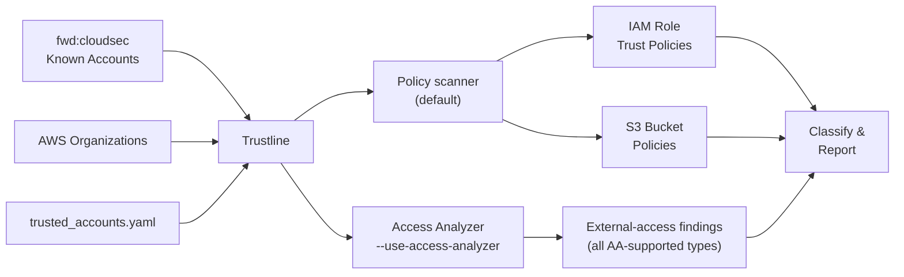

# AWS Trustline

> Map and audit third-party trust relationships in your AWS account.

AWS Trustline analyzes IAM Role trust policies and S3 bucket policies to identify who has access to your AWS resources. It cross-references AWS account IDs found in these policies against a community-maintained list of [known AWS accounts](https://github.com/fwdcloudsec/known_aws_accounts) from [fwd:cloudsec](https://fwdcloudsec.org/) to automatically identify the vendors behind those accounts.

## Features

- **Two analysis backends**:
  - **Policy scanner (default)**: scans IAM role trust policies and S3 bucket policies directly with the AWS SDK.
  - **Access Analyzer backend (`--use-access-analyzer`)**: consumes findings from AWS IAM Access Analyzer (external access, **free tier**) for provable, all-resource-type coverage: S3, IAM roles, KMS, Lambda, SNS, SQS, Secrets Manager, EFS, EBS/RDS snapshots, ECR, DynamoDB.
- **Account or Organization scope**: pick `--scope account` for a single-account analyzer, `--scope organization` to consume findings from an org-wide analyzer (run from the management or AA delegated-admin account).
- **Multi-region**: `--regions us-east-1,eu-west-1` or `--all-regions` (enumerated via `ec2:DescribeRegions`).
- **Vendor Identification**: matches external account IDs against 500+ known AWS vendor accounts from [fwd:cloudsec](https://github.com/fwdcloudsec/known_aws_accounts).
- **Confused Deputy Detection**: flags IAM roles missing the `ExternalId` condition on cross-account trust (works in both backends).
- **Public access detection**: the Access Analyzer backend surfaces resources shared with the world in a dedicated section.
- **AWS Organizations Support**: automatically fetches your org accounts as trusted entities and labels them in org-scoped reports.
- **Custom Trusted Accounts**: define your own trusted accounts via YAML configuration.
- **HTML and Markdown reports**: self-contained HTML report (no JS, viewable offline) in the [iamtrail.com](https://iamtrail.com) design system, plus the original Markdown report.
- **CLI Flexibility**: AWS profiles, regions, selective analysis, custom output paths.

## How It Works


```mermaid
flowchart LR
    A["fwd:cloudsec<br/>Known Accounts"] --> D[Trustline]
    B[AWS Organizations] --> D
    C[trusted_accounts.yaml] --> D
    D --> P["Policy scanner<br/>(default)"]
    D --> AA["Access Analyzer<br/>--use-access-analyzer"]
    P --> E["IAM Role<br/>Trust Policies"]
    P --> F["S3 Bucket<br/>Policies"]
    AA --> G["External-access findings<br/>(all AA-supported types)"]
    E --> R["Classify &<br/>Report"]
    F --> R
    G --> R
```

1. **Gather reference data**: fetches the latest known AWS vendor accounts from fwd:cloudsec, your AWS Organization members, and any locally defined trusted accounts
2. **Collect access information**
   - Default backend reads all IAM role trust policies and S3 bucket policies in the target account.
   - Access Analyzer backend pulls findings from existing external analyzers (account-scoped or org-scoped) in the target regions.
3. **Classify access**: categorizes every external principal as _trusted_, _known vendor_, _public_, or _unknown_
4. **Detect vulnerabilities**: flags cross-account roles missing the `ExternalId` condition (confused deputy risk)
5. **Report**: displays results in the console and writes an HTML report (and/or Markdown via `--format`)

## Quick Start

```bash
git clone https://github.com/zoph-io/aws-trustline.git
cd aws-trustline
pip install -r requirements.txt
python trustline.py
```

## Installation

1. Clone this repository:

   ```bash
   git clone https://github.com/zoph-io/aws-trustline.git
   cd aws-trustline
   ```

2. Install dependencies:

   ```bash
   pip install -r requirements.txt
   ```

3. Authenticate to AWS using **short-lived credentials**. Trustline uses the
   standard boto3 credential provider chain, so anything that produces
   temporary credentials in your shell will work. Recommended options:

   - **IAM Identity Center (AWS SSO)** via a named profile:

     ```bash
     aws configure sso
     aws sso login --profile my-profile
     python trustline.py --profile my-profile
     ```

   - **`aws-vault`** wrapping any role-based or SSO profile:

     ```bash
     aws-vault exec my-profile -- python trustline.py
     ```

   - **An assumed IAM role** (instance profile, EKS Pod Identity, GitHub
     OIDC, etc.) when running inside AWS or from CI.

   Avoid long-lived IAM user access keys. If you must use them temporarily,
   prefer scoped, short-rotation credentials and never commit them to disk.

## Usage

### Policy scanner (default)

```bash
# Basic usage (analyzes IAM roles and S3 buckets in the current account)
python trustline.py

# Use a specific AWS profile
python trustline.py --profile production

# Skip S3 analysis (IAM roles only)
python trustline.py --skip-s3

# Custom output directory and trusted accounts file
# (default output is ./reports/, with files named
#  trustline_report_<account-or-org>_<YYYYmmdd_HHMMSS>.<html|md>)
python trustline.py --output /tmp/reports --trusted-accounts my-accounts.yaml

# Emit both Markdown and HTML
python trustline.py --format both
```

### Access Analyzer backend

Consumes findings from an **existing** external IAM Access Analyzer (external-access analyzers are free; see [Cost](#cost)). The tool will not create analyzers for you. If none exists in the requested scope/regions it prints the `aws accessanalyzer create-analyzer` command to run.

```bash
# Current account, current region
python trustline.py --use-access-analyzer

# Org-wide (run from the management or AA delegated-admin account), all regions
python trustline.py --use-access-analyzer --scope organization --all-regions

# Specific regions, account scope, emit both HTML and Markdown
python trustline.py --use-access-analyzer --regions us-east-1,eu-west-1 \
    --scope account --format both --output ./reports

# Auto-detect (prefers an ORGANIZATION analyzer if present)
python trustline.py --use-access-analyzer --scope auto
```

When `--scope organization` is used, findings are grouped and labeled by `resourceOwnerAccount` using the names from AWS Organizations.

### CLI Options

| Option | Short | Description |
|--------|-------|-------------|
| `--profile` | `-p` | AWS profile name |
| `--region` | `-r` | AWS region override for the session |
| `--output` | `-o` | Output directory for reports (default: `reports/`; each run writes a timestamped file, never overwriting) |
| `--trusted-accounts` | `-t` | Path to trusted accounts YAML (default: `trusted_accounts.yaml`) |
| `--skip-iam` | | Skip IAM role trust policy analysis (policy scanner only) |
| `--skip-s3` | | Skip S3 bucket policy analysis (policy scanner only) |
| `--use-access-analyzer` | | Use IAM Access Analyzer findings as the source of truth |
| `--scope` | | `auto` (default), `account`, or `organization` |
| `--regions` | | Comma-separated regions for the AA backend (e.g. `us-east-1,eu-west-1`) |
| `--all-regions` | | Query every enabled region (AA backend, enumerated via `ec2:DescribeRegions`) |
| `--format` | | `html` (AA default), `md` (policy-scanner default), or `both` |
| `--verbose` | | Show full error tracebacks |
| `--version` | `-V` | Print version and exit |

### Cost

The **external access analyzer is free**. There is no per-resource or per-region charge for the `--use-access-analyzer` mode. AWS bills only for the *unused-access* and *internal-access* analyzer types, which Trustline does not use.

## Required AWS Permissions

### Policy scanner backend (default)

```json
{
  "Version": "2012-10-17",
  "Statement": [
    {
      "Effect": "Allow",
      "Action": ["iam:ListRoles", "iam:GetRole", "iam:ListAccountAliases"],
      "Resource": "*"
    },
    {
      "Effect": "Allow",
      "Action": ["s3:ListAllMyBuckets", "s3:GetBucketPolicy"],
      "Resource": "*"
    },
    {
      "Effect": "Allow",
      "Action": ["sts:GetCallerIdentity"],
      "Resource": "*"
    },
    {
      "Effect": "Allow",
      "Action": ["organizations:ListAccounts"],
      "Resource": "*"
    }
  ]
}
```

Or use existing AWS managed policies:

- `IAMReadOnlyAccess` (IAM role analysis)
- `AmazonS3ReadOnlyAccess` (S3 bucket policy analysis)
- `AWSOrganizationsReadOnlyAccess` (Organization account listing)

The Organizations permission is optional; if unavailable, only the YAML-configured trusted accounts will be used.

### Access Analyzer backend (`--use-access-analyzer`)

Add the following to the IAM permissions above:

```json
{
  "Version": "2012-10-17",
  "Statement": [
    {
      "Effect": "Allow",
      "Action": [
        "access-analyzer:ListAnalyzers",
        "access-analyzer:ListFindings",
        "access-analyzer:GetFinding"
      ],
      "Resource": "*"
    },
    {
      "Effect": "Allow",
      "Action": ["ec2:DescribeRegions"],
      "Resource": "*"
    }
  ]
}
```

`ec2:DescribeRegions` is only needed when `--all-regions` is used. For `--scope organization`, the caller must be in the AWS Organizations management account or the IAM Access Analyzer delegated-admin account so that the org-level analyzer exists in their account.

## Trusted Accounts Configuration

Define your own trusted AWS accounts to distinguish internal accounts from external vendors.

1. Copy the sample file:

   ```bash
   cp trusted_accounts.yaml.sample trusted_accounts.yaml
   ```

2. Edit with your organization's accounts:

   ```yaml
   - name: "My Company Production"
     description: "Production AWS accounts"
     accounts:
       - "123456789012"
       - "234567890123"

   - name: "My Company Development"
     description: "Development AWS accounts"
     accounts:
       - "345678901234"
   ```

If `trusted_accounts.yaml` does not exist, the tool relies solely on AWS Organizations data (if accessible).

## Security Checks

### Confused Deputy Detection

The tool checks whether IAM roles with cross-account access include an `ExternalId` condition. The [confused deputy problem](https://docs.aws.amazon.com/IAM/latest/UserGuide/confused-deputy.html) occurs when a third-party service is tricked into misusing its access to act on behalf of another account. Roles that allow external `AssumeRole` without an `ExternalId` condition are flagged as vulnerable.

Both backends produce this signal: the policy scanner re-derives it from each role's trust policy, and the Access Analyzer backend re-derives it from the `condition` map carried on each `AWS::IAM::Role` finding.

### Public access (Access Analyzer backend)

The AA backend surfaces any resource that the analyzer determined is shared with everyone (`isPublic == true`, e.g. an S3 bucket with `Principal: "*"` and no compensating condition / Public Access Block) in a dedicated section of the report.

## Choosing a backend

| Aspect | Policy scanner (default) | Access Analyzer (`--use-access-analyzer`) |
|---|---|---|
| Setup | None, runs immediately | Requires an existing external analyzer (free); will instruct you how to create one |
| Resource coverage | IAM roles + S3 buckets | All [AA-supported types](https://docs.aws.amazon.com/IAM/latest/UserGuide/access-analyzer-resources.html): IAM, S3, KMS, Lambda, SNS, SQS, Secrets Manager, EBS/RDS snapshots, ECR, EFS, DynamoDB |
| Cross-account accuracy | Regex over `Principal.AWS` (ignores Deny / conditions / Public Access Block) | Provable reasoning (respects Deny, conditions, Public Access Block, org zone-of-trust) |
| Org scope | Single account | Single account *or* whole AWS Organization (with one ORGANIZATION analyzer) |
| Public detection | No | Yes, dedicated section |
| Confused-deputy check | Yes | Yes |
| Cost | Free | Free (external-access analyzers are no-charge) |
| Freshness | Live API calls | Reads cached findings (AA refreshes asynchronously) |

A few things to know about the Access Analyzer backend:

- **Findings are generated asynchronously** by IAM Access Analyzer. After creating an analyzer it may take a few minutes for findings to appear; Trustline does not wait.
- **External analyzers are regional** for resource-based policies (S3, KMS, SQS, etc.). IAM roles are global, so any one region covers them. Use `--all-regions` to cover everything.
- **Organization-scope analyzers treat sibling org accounts as in-zone-of-trust**, so they will *not* show up as findings (less noise, but fewer "trusted entity" rows than the policy scanner's regex backend).

## Sample Output

```
╭──────────────────── AWS Trustline ────────────────────╮
│ AWS Trustline                                         │
│ Map and audit third-party trust relationships in your │
│ AWS account.                                          │
╰───────────────────────────────────────────────────────╯

Fetching reference data of known AWS accounts...
Found 480 known AWS accounts in the reference data
Loading trusted AWS accounts...
Found 12 accounts in AWS Organization

Analyzing AWS Account: 123456789012 (my-company-dev)

╭─ Known Vendors with IAM Role Access ─╮
│ Vendor   │ IAM Roles                  │
│──────────┼────────────────────────────│
│ Datadog  │ DatadogIntegrationRole     │
╰──────────────────────────────────────╯

╭── IAM Roles Missing ExternalId Condition ──╮
│ Entity   │ Source │ Vulnerable IAM Roles    │
│──────────┼────────┼─────────────────────────│
│ Datadog  │ vendor │ DatadogIntegrationRole  │
╰────────────────────────────────────────────╯

╭────────── AWS Trustline Results ──────────╮
│ Summary:                                  │
│ Trusted entities found: 1                 │
│ Known vendors found: 1                    │
│ Unknown AWS accounts found: 0             │
│ Vulnerable IAM roles (missing ExternalId) │
╰───────────────────────────────────────────╯

Report generated: trustline_report_123456789012_20250425_123045.md
```

## Scheduled scanning on AWS

To run Trustline on a schedule as an AWS Lambda (EventBridge cron, S3-stored
HTML reports, optional SNS alerts on findings), see
[`iac/README.md`](iac/README.md). The IaC is a SAM template deployable with
`sam build && sam deploy --guided`.

## Contributing

Contributions are welcome! If you know of additional AWS account IDs that should be added to the vendor reference data, please also contribute to the [fwd:cloudsec known_aws_accounts](https://github.com/fwdcloudsec/known_aws_accounts) repository.

## License

Licensed under the [Apache License 2.0](LICENSE). See [NOTICE](NOTICE) for
required attribution when redistributing.

Copyright 2025-2026 Victor Grenu / zoph.io.
