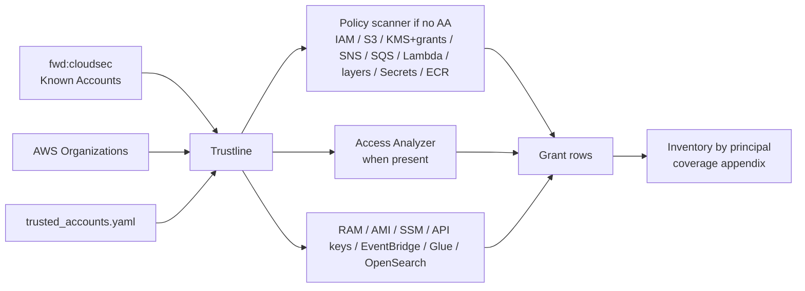

# AWS Trustline

> Map current external access in an AWS account. Name the vendor when the account ID is known. Say what you did not scan.

Trustline collects **grant rows** (one resource × one principal × one mechanism), **groups them by external party**, and looks up 12-digit account IDs in [fwd:cloudsec known AWS accounts](https://github.com/fwdcloudsec/known_aws_accounts) (plus your YAML and Organizations). If an Access Analyzer exists, it is used by default so S3/IAM-class access is **effective** (Deny and Block Public Access). Coverage of what was **not** scanned lives in an appendix.

## How to read a report

The first table is the **inventory**: one row per external party, with the resolved name and which directory produced it. The Resources column includes the AWS type when the last ARN segment is a UUID, a short digit, or not an IAM role / S3 bucket name. The HTML report filters that table by classification (chips under the heading, or click a party KPI).

| Classification | Meaning |
|---|---|
| **unknown** | 12-digit ID looked up; **not** in known_aws_accounts, YAML, or Organizations |
| **public** | Currently shared with everyone (`*` or `all`) |
| **vendor** | Named in fwd:cloudsec (or AWS aliases such as Redshift Support) |
| **federated** | GitHub Actions, GitLab, SAML, or Cognito — no account ID to look up |
| **trusted** | Your Organization, your YAML file, or CloudFront OAI/OAC |

Name source is `fwd:cloudsec`, `trusted_accounts.yaml`, `AWS Organizations`, or **not in known_aws_accounts**. Org siblings are still listed — they are external to *this* account, just named.

Leftover flags come after the inventory: OIDC missing `sub`/`aud`, missing ExternalId, never-expiring keys, and S3 `Allow *` that Block Public Access currently denies. Coverage is last (collapsed on HTML). A regional collector that times out is **not scanned**, not an empty success.

## Quick start

```bash
git clone https://github.com/zoph-io/aws-trustline.git
cd aws-trustline
pip install -r requirements.txt

# Short-lived credentials (IAM Identity Center, aws-vault, or an assumed role)
aws sso login --profile my-profile
python trustline.py --profile my-profile
```

Trustline uses the standard boto3 credential chain. Prefer IAM Identity Center, `aws-vault exec my-profile -- python trustline.py`, or a runtime role. Avoid long-lived access keys.

Member accounts cannot call `organizations:ListAccounts`. Copy the sample and list sibling account IDs, or those trusts land on **unknown**:

```bash
cp trusted_accounts.yaml.sample trusted_accounts.yaml
```

## Sample output

Placeholder IDs and names only. The inventory is first; leftover flags follow.

```
╭──────────────────── AWS Trustline ────────────────────╮
│ AWS Trustline                                         │
│ Map current external access and name the vendor when  │
│ the account is known.                                 │
╰───────────────────────────────────────────────────────╯

Fetching reference data of known AWS accounts...
Found 480 known AWS accounts in the reference data
Loading trusted AWS accounts...
Found 12 accounts in AWS Organization
Loaded 3 trusted AWS accounts from YAML file
Looking for external analyzers in 1 region(s) (scope: auto)...
No external Access Analyzer in requested regions; walking IAM/S3 policies.
Backend: Policy scanner    Output: md

Analyzing: 111122223333 (example-alias)

╭─ External access by principal (3) ─╮
│ 333333333333 (Datadog) │ fwd:cloudsec │ vendor │ 2 │ ExampleRole, example-bucket │
│ GitHub Actions OIDC │ federated (no account ID) │ federated │ 1 │ ExampleGithubRole │
│ 222222222222 (Prod) │ trusted_accounts.yaml │ trusted │ 1 │ CrossAccountRole │
╰────────────────────────────────────╯

╭────────── OIDC missing sub/aud (1) ──────────╮
│ ExampleGithubRole │ GitHub Actions OIDC │ IAM role trust policy │ federated │
╰──────────────────────────────────────────────╯

╭────────── AWS Trustline Results ──────────╮
│ External parties: 3                       │
│ Unknown parties: 0                        │
│ Public parties: 0                         │
│ Vendor parties: 1                         │
│ Federated parties: 1                      │
│ Trusted parties: 1                        │
│ Missing ExternalId (grants): 0            │
│ OIDC missing sub/aud (grants): 1          │
│ Never-expiring credentials: 0             │
│ Total grants: 3                           │
╰───────────────────────────────────────────╯

Markdown report: reports/trustline_report_111122223333_20260904_120000.md
```

## How it works


```mermaid
flowchart LR
    A["fwd:cloudsec<br/>Known Accounts"] --> D[Trustline]
    B[AWS Organizations] --> D
    C[trusted_accounts.yaml] --> D
    D --> P["Policy scanner if no AA<br/>IAM / S3 / KMS+grants / SNS / SQS / Lambda / layers / Secrets / ECR"]
    D --> AA["Access Analyzer<br/>when present"]
    D --> X["RAM / AMI / SSM / API keys / EventBridge / Glue / OpenSearch"]
    P --> G["Grant rows"]
    AA --> G
    X --> G
    G --> R["Inventory by principal<br/>coverage appendix"]
```

1. Load vendor IDs (fwd:cloudsec, cached under `~/.cache/aws-trustline/`), Organization members and org ID (if allowed), and YAML trusted accounts.
2. If an **ACCOUNT** Access Analyzer exists in the requested regions, use it for IAM/S3-class resources. If only an ORGANIZATION analyzer exists, use it but **keep findings owned by this account** (pass `--scope organization` for the whole org). Otherwise walk IAM trusts, S3 bucket policies, KMS key policies **and** `ListGrants`, and SNS / SQS / Lambda / Lambda layer / Secrets Manager / ECR resource policies. RAM, AMI, SSM, and credentials always run unless skipped. EventBridge bus policies, Glue Data Catalog resource policies, and OpenSearch domain access policies always run (Access Analyzer does not cover them).
3. Classify each grant and **group by principal**. Resolve 12-digit IDs. CloudFront OAI/OAC is trusted AWS (one party). Flag missing ExternalId, GitHub/GitLab `sub`/`aud`, and never-expiring credentials. Policy-scanner public S3 is checked with `GetBucketPolicyStatus`. Access Analyzer leftover flags for IAM roles are taken from the live trust policy (`iam:GetRole`), not from findings that omit Condition.
4. Print the inventory, then leftover flags. Coverage is an appendix.

Mechanisms: trust policy, S3 bucket policy, KMS key policy, KMS cryptographic grant, SNS/SQS/Lambda/Lambda layer/Secrets Manager/ECR/EventBridge/Glue/OpenSearch resource policy, RAM share, AMI launch permission, SSM document share, service-specific credential, or Access Analyzer finding.

## Usage

Default: **use Access Analyzer when one exists** (effective access for AA resource types). `--scope auto` (default) **prefers ACCOUNT analyzers** so the inventory is this account. ORGANIZATION analyzers are used only when no ACCOUNT analyzer exists in that region, and those findings are still limited to this account unless you pass `--scope organization`. If none exists, walk IAM trusts, S3 bucket policies, KMS key policies and cryptographic grants, and SNS / SQS / Lambda / Lambda layer / Secrets Manager / ECR resource policies. RAM, AMI, SSM, and service-specific credentials run in both cases unless skipped. EventBridge, Glue Data Catalog, and OpenSearch domain policies always run.

```bash
python trustline.py

# Every enabled region (needed to discover analyzers + RAM / AMI / SSM)
python trustline.py --all-regions --format both

# Force the IAM/S3 policy walk even if an analyzer exists
python trustline.py --policy-scanner

# Require Access Analyzer (fail if none)
python trustline.py --use-access-analyzer --wait-for-analyzer

# Machine-readable inventory (parties + grants) for pipelines
python trustline.py --format json

# Skip slower collectors
python trustline.py --skip-ram --skip-ami --skip-ssm --skip-credentials
```

Regional collectors use the session region unless you pass `--regions` or `--all-regions`.

### Access Analyzer

Consumes findings from an **existing** external IAM Access Analyzer (free; see [Cost](#cost)). Trustline will not create analyzers. `--use-access-analyzer` fails if none exists and prints the create command. Default hybrid falls back to the policy scanner instead.

Analyzer status `ACTIVE` is not scan-complete. Pass `--wait-for-analyzer` when analyzers are used (default 300s; first scans can take ~20 minutes).

`--scope auto` does **not** treat an org analyzer as a whole-org report. Report filenames use the caller account ID unless you pass `--scope organization`.

```bash
python trustline.py --use-access-analyzer --scope organization --all-regions

python trustline.py --use-access-analyzer --regions us-east-1,eu-west-1 \
    --scope account --format both --output ./reports
```

With `--scope organization`, findings are grouped by `resourceOwnerAccount` using Organizations names. Organization-scope analyzers treat sibling accounts as in-zone-of-trust, so they will not appear as AA findings.

### CLI options

| Option | Short | Description |
|--------|-------|-------------|
| `--profile` | `-p` | AWS profile name |
| `--region` | `-r` | Session region override |
| `--output` | `-o` | Report directory (default: `reports/`; timestamped files, never overwritten) |
| `--trusted-accounts` | `-t` | YAML path (default: `trusted_accounts.yaml`) |
| `--skip-iam` | | Skip IAM role trusts (policy scanner only) |
| `--skip-s3` | | Skip S3 bucket policies (policy scanner only) |
| `--skip-resource-policies` | | Skip KMS (policy + ListGrants)/SNS/SQS/Lambda/layer/Secrets/ECR (policy scanner only) |
| `--skip-ram` | | Skip RAM resource shares |
| `--skip-ami` | | Skip AMI launch permissions |
| `--skip-ssm` | | Skip SSM document shares |
| `--skip-credentials` | | Skip IAM service-specific credentials / long-lived API keys |
| `--use-access-analyzer` | | Require Access Analyzer (fail if none). Default uses it when found |
| `--policy-scanner` | | Walk IAM/S3 policies even if an analyzer exists |
| `--wait-for-analyzer` | | Poll until ACTIVE finding counts stabilize when analyzers are used |
| `--wait-timeout` | | Seconds to wait (default: 300) |
| `--scope` | | `auto` (default: prefer ACCOUNT analyzers; this-account inventory), `account`, or `organization` |
| `--regions` | | Comma-separated regions for RAM / AMI / SSM / AA / resource policies / EventBridge / Glue / OpenSearch |
| `--all-regions` | | Every enabled region (`ec2:DescribeRegions`) |
| `--format` | | `html` (AA default), `md` (policy-scanner default), `json` (parties + grants), or `both` (html+md) |
| `--verbose` | | Full error tracebacks |
| `--version` | `-V` | Print version and exit |

### Cost

The **external access analyzer is free**. AWS bills unused-access and internal-access analyzers; Trustline does not use those.

## Trusted accounts

```bash
cp trusted_accounts.yaml.sample trusted_accounts.yaml
```

```yaml
- name: "My Company Production"
  description: "Production AWS accounts"
  accounts:
    - "123456789012"
    - "234567890123"
```

YAML names **win** over fwd:cloudsec aliases for the same ID (so your own prod account is trusted, not a “vendor”). Unquoted 12-digit IDs are accepted. If the file is missing, only Organizations data is used — and **member accounts cannot list the org**.

fwd:cloudsec is fetched from GitHub and cached at `~/.cache/aws-trustline/known_aws_accounts.yaml` (override with `TRUSTLINE_CACHE_DIR`). If GitHub is unreachable, the cache is used.

## Security checks

**Confused deputy (`sts:ExternalId`).** Flagged per grant (per statement), not per role. **Not flagged:** trusted principals (org / YAML / CloudFront) and AWS org bootstrap roles (`OrganizationAccountAccessRole`, `stacksets-exec-*`, `AWSControlTowerExecution`, `AWSControlTowerAdmin`). Vendors without ExternalId still are — that is the Datadog-shaped case.

**OIDC `sub` / `aud`.** GitHub Actions trusts missing `token.actions.githubusercontent.com:sub` or `:aud`, and GitLab trusts missing `sub`, are flagged. The account ID in the OIDC provider ARN is yours, not the external party. On the Access Analyzer path, Trustline calls `iam:GetRole` for roles in this account because Analyzer findings often omit Condition (an empty finding is not a leftover).

**Public access.** `Principal: "*"`, AMI `Group=all`, and SSM `AccountIds=all` become public grants. The policy scanner then calls `GetBucketPolicyStatus` on S3 `Allow *` rows: if Block Public Access currently denies the bucket, that row is **not** current public access (listed separately). Access Analyzer `isPublic` already includes BPA and Deny.

**Never-expiring service-specific credentials.** Active IAM credentials with no expiration (Bedrock / CloudWatch API keys default to this on the CLI) are leftover.

## Coverage appendix

Reports **end** with what was scanned and what was not. HTML keeps that block collapsed.

Not scanned (always listed):

- Lake Formation grants
- Kafka ACLs on MSK
- OpenSearch fine-grained access control
- OpenSearch Serverless data access policies
- PrivateLink allowed principals
- Route 53 VPC association authorizations
- Copies, replication, and DLM share rules
- SES sending authorization

The **policy scanner** does not evaluate Deny. `Principal: "*"` with `aws:SourceAccount` / `aws:SourceArn` is not treated as public (SNS/Lambda notification pattern); a SourceAccount is named as that party instead. `Principal: "*"` with `aws:PrincipalOrgID` is named as that organization (trusted if it is yours). It walks KMS key policies and cryptographic grants (`ListGrants`), SNS, SQS, Lambda function, Lambda layer (up to 25 newest versions per layer), Secrets Manager, and ECR repository resource policies (Allow-principal matching). EventBridge bus policies, Glue Data Catalog resource policies, and OpenSearch **domain** access policies run on **both** backends (Access Analyzer does not cover them; OpenSearch fine-grained access control and Serverless data-access policies stay out of scope). It still does not cover S3 ACLs, EFS, or RDS snapshots. Public S3 `Allow *` is checked with `GetBucketPolicyStatus`.

**Access Analyzer** only reasons about [its documented resource types](https://docs.aws.amazon.com/IAM/latest/UserGuide/access-analyzer-resources.html) (S3, IAM roles, KMS, Lambda, SQS, …). RAM shares, AMI launch permissions, and SSM document shares are outside that ceiling; Trustline scans those separately. Lambda aliases/versions and service principals stay not-scanned. Organization-scope analyzers treat sibling accounts as in-zone-of-trust, so they will not appear as AA findings. Duplicate findings for the same IAM role from two analyzers are collapsed. The appendix prints the exact type list the tool uses.

## Choosing a backend

Default is **hybrid**: Access Analyzer when one exists, otherwise the policy scanner. RAM / AMI / SSM / credentials always run unless skipped. EventBridge, Glue catalog, and OpenSearch domain policies always run.

| Aspect | Policy scanner (`--policy-scanner` or no analyzer) | Access Analyzer (default when found) |
|---|---|---|
| Setup | Runs immediately | Needs an existing external analyzer (free) |
| IAM / S3-class coverage | IAM trusts, S3 buckets, KMS keys (policy + ListGrants), SNS, SQS, Lambda, layers, Secrets Manager, ECR | [AA-supported types](https://docs.aws.amazon.com/IAM/latest/UserGuide/access-analyzer-resources.html) (includes KMS grants) |
| RAM / AMI / SSM / API keys | Yes (unless `--skip-*`) | Yes (unless `--skip-*`) |
| EventBridge / Glue / OpenSearch domain | Yes | Yes |
| Cross-account accuracy | Allow-principal matching; S3 public checked via GetBucketPolicyStatus | Provable reasoning (Deny, conditions, BPA, org zone-of-trust) |
| Report | Inventory by principal; unresolved IDs labeled | Same inventory |
| Freshness | Live API calls | Cached findings; `--wait-for-analyzer` polls until counts stabilize |
| Cost | Free | Free (external-access analyzers) |

## Required AWS permissions

### Policy scanner

```json
{
  "Version": "2012-10-17",
  "Statement": [
    {
      "Effect": "Allow",
      "Action": [
        "iam:ListRoles",
        "iam:GetRole",
        "iam:ListAccountAliases",
        "iam:ListServiceSpecificCredentials"
      ],
      "Resource": "*"
    },
    {
      "Effect": "Allow",
      "Action": ["s3:ListAllMyBuckets", "s3:GetBucketPolicy", "s3:GetBucketPolicyStatus"],
      "Resource": "*"
    },
    {
      "Effect": "Allow",
      "Action": [
        "kms:ListKeys",
        "kms:DescribeKey",
        "kms:GetKeyPolicy",
        "kms:ListGrants",
        "sns:ListTopics",
        "sns:GetTopicAttributes",
        "sqs:ListQueues",
        "sqs:GetQueueAttributes",
        "lambda:ListFunctions",
        "lambda:GetPolicy",
        "lambda:ListLayers",
        "lambda:ListLayerVersions",
        "lambda:GetLayerVersionPolicy",
        "secretsmanager:ListSecrets",
        "secretsmanager:GetResourcePolicy",
        "ecr:DescribeRepositories",
        "ecr:GetRepositoryPolicy",
        "events:ListEventBuses",
        "events:DescribeEventBus",
        "glue:GetResourcePolicy",
        "es:ListDomainNames",
        "es:DescribeDomain"
      ],
      "Resource": "*"
    },
    {
      "Effect": "Allow",
      "Action": [
        "ram:GetResourceShareAssociations",
        "ram:ListResourceSharePermissions",
        "ram:GetPermission"
      ],
      "Resource": "*"
    },
    {
      "Effect": "Allow",
      "Action": ["ec2:DescribeRegions", "ec2:DescribeImages", "ec2:DescribeImageAttribute"],
      "Resource": "*"
    },
    {
      "Effect": "Allow",
      "Action": ["ssm:ListDocuments", "ssm:DescribeDocumentPermission"],
      "Resource": "*"
    },
    {
      "Effect": "Allow",
      "Action": ["sts:GetCallerIdentity"],
      "Resource": "*"
    },
    {
      "Effect": "Allow",
      "Action": ["organizations:ListAccounts", "organizations:DescribeOrganization"],
      "Resource": "*"
    }
  ]
}
```

Or managed policies plus the RAM / SSM / EC2 image actions above: `IAMReadOnlyAccess`, `AmazonS3ReadOnlyAccess`, `AWSOrganizationsReadOnlyAccess`.

Organizations permissions are optional. Without them, only YAML trusted accounts are used, and organization ARNs on AMIs/RAM shares are not recognized as “this org.”

### Access Analyzer (`--use-access-analyzer`)

Add:

```json
{
  "Version": "2012-10-17",
  "Statement": [
    {
      "Effect": "Allow",
      "Action": [
        "access-analyzer:ListAnalyzers",
        "access-analyzer:ListFindings",
        "access-analyzer:GetFinding",
        "iam:GetRole"
      ],
      "Resource": "*"
    }
  ]
}
```

`ec2:DescribeRegions` is needed for `--all-regions`. For `--scope organization`, the caller must be in the Organizations management account or the IAM Access Analyzer delegated-admin account.

EventBridge bus policies, Glue Data Catalog resource policies, and OpenSearch domain access policies are **not** Access Analyzer resource types. The Lambda/scheduled scanner still needs `events:ListEventBuses`, `events:DescribeEventBus`, `glue:GetResourcePolicy`, `es:ListDomainNames`, and `es:DescribeDomain` (included in the policy-scanner block above).

## Scheduled scanning on AWS

Lambda + EventBridge + S3 HTML reports, optional SNS on leftover: [`iac/README.md`](iac/README.md). Deploy with `sam build && sam deploy --guided`.

## Contributing

If you know AWS account IDs that should be named as vendors, contribute them to [fwd:cloudsec known_aws_accounts](https://github.com/fwdcloudsec/known_aws_accounts).

## License

Licensed under the [Apache License 2.0](LICENSE). See [NOTICE](NOTICE) for required attribution when redistributing.

Copyright 2025-2026 Victor Grenu / zoph.io.
