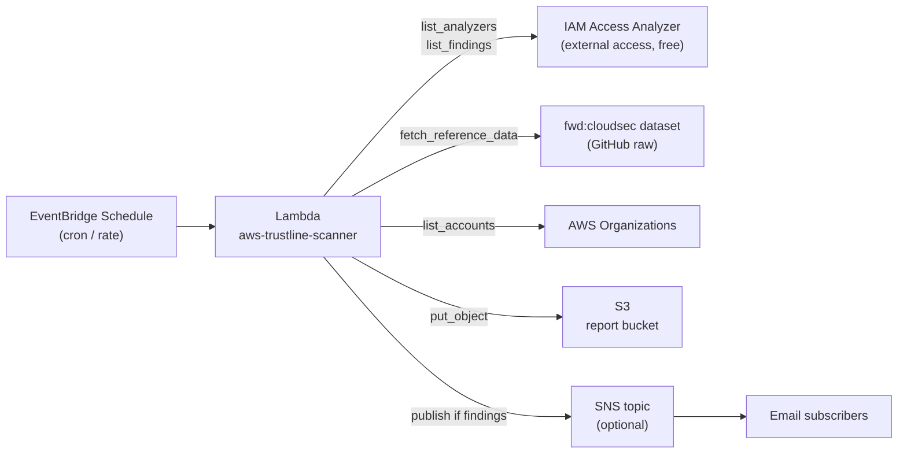

# AWS Trustline scheduled scanner (Lambda + EventBridge + S3)

Deploy [AWS Trustline](../README.md) as a scheduled AWS Lambda. Grant rows from
IAM Access Analyzer (plus RAM / AMI / SSM / credentials) are classified against
the [fwd:cloudsec](https://github.com/fwdcloudsec/known_aws_accounts) vendor
dataset. The HTML report leads with leftover, ends with a collapsed coverage
appendix, is uploaded to S3, and (optionally) summarized over SNS when leftover
warrants attention.

The Access Analyzer external-access tier is free, so this stack adds no
analyzer costs. You only pay for Lambda invocations, CloudWatch Logs, S3
storage, and any optional SNS deliveries.

## Architecture



## Prerequisites

1. **An existing external Access Analyzer in every region you want to cover.**
   This stack does **not** create analyzers because they are a separate
   security-org concern. To create one in a given region:

   ```bash
   # Per-account analyzer (covers this account's resources)
   aws accessanalyzer create-analyzer \
       --analyzer-name trustline \
       --type ACCOUNT \
       --region eu-west-1

   # Organization-wide analyzer (covers every member account).
   # MUST run from the org management account or the AA delegated-admin
   # account, otherwise the API returns AccessDenied.
   aws accessanalyzer create-analyzer \
       --analyzer-name trustline-org \
       --type ORGANIZATION \
       --region us-east-1
   ```

   To create one analyzer per region in one shot:

   ```bash
   for r in $(aws ec2 describe-regions --query 'Regions[].RegionName' --output text); do
     aws accessanalyzer create-analyzer \
       --analyzer-name trustline \
       --type ACCOUNT \
       --region "$r" || true
   done
   ```

2. **AWS SAM CLI** (1.115+). Install:

   ```bash
   brew install aws-sam-cli   # macOS
   # or:  pipx install aws-sam-cli
   ```

3. **GNU make** and **Python 3.12** on the build host (used by SAM's
   `BuildMethod: makefile` to bundle `trustline.py` and `pip install`
   dependencies for `arm64`). macOS and most Linux distros ship both.

4. **AWS credentials** with permission to create the stack's resources
   (Lambda, IAM role, S3 bucket, EventBridge Scheduler, optional SNS, log
   group). For org-scope scans the credentials must belong to the AWS
   Organizations management account or to the IAM Access Analyzer delegated
   administrator.

## Deploy

```bash
cd iac

# (optional) seed default parameters
cp samconfig.toml.sample samconfig.toml

# Build the Lambda artifact (bundles ../trustline.py + pinned deps for arm64)
sam build

# First deploy (interactive). Subsequent deploys just need `sam deploy`.
sam deploy --guided
```

`sam deploy --guided` will prompt for each parameter and remember your
choices in `samconfig.toml`. The defaults are sensible for a single-account
deployment with daily scans at 06:00 UTC and no SNS alerting.

### Parameters

| Parameter | Default | What it controls |
|---|---|---|
| `Scope` | `auto` | `auto` (prefers ORGANIZATION if present), `account`, or `organization` |
| `Regions` | `all` | `all` (enumerate via `ec2:DescribeRegions`) or comma list `us-east-1,eu-west-1` |
| `ScheduleExpression` | `cron(0 6 * * ? *)` | EventBridge cron or rate expression |
| `ScheduleTimezone` | `UTC` | IANA timezone (e.g. `Europe/Paris`) |
| `AlertEmail` | empty | Empty disables SNS entirely; otherwise an email subscription is created (confirm it after deploy) |
| `LambdaMemoryMB` | `512` | Bump to `1024`+ for very large orgs with many regions |
| `LambdaTimeoutSeconds` | `600` | Hard cap 900s. Use `Regions=` (narrower list) instead of bumping if a single region is slow |
| `LogRetentionDays` | `30` | CloudWatch Logs retention |
| `ReportRetentionDays` | `365` | S3 lifecycle expiration for past report objects |

## Verifying

```bash
# Tail the stack outputs
sam list stack-outputs --stack-name aws-trustline

# Trigger an on-demand scan
aws lambda invoke \
    --function-name aws-trustline-scanner \
    --cli-binary-format raw-in-base64-out \
    --payload '{}' /tmp/trustline-out.json \
&& cat /tmp/trustline-out.json | jq .

# Browse generated reports in S3 (key format: reports/YYYY/MM/DD/<file>.html)
aws s3 ls "s3://$(aws cloudformation describe-stacks \
    --stack-name aws-trustline \
    --query 'Stacks[0].Outputs[?OutputKey==`ReportBucketName`].OutputValue' \
    --output text)/reports/" --recursive
```

A successful invoke returns (numbers are placeholders):

```json
{
  "status": "ok",
  "scope": "organization",
  "regions": ["eu-west-1", "us-east-1"],
  "totals": {
    "trusted": 10,
    "vendors": 0,
    "federated": 4,
    "unknown": 1,
    "public": 1,
    "missing_external_id": 0,
    "missing_oidc_subject": 1,
    "never_expires": 0,
    "findings": 16,
    "owner_accounts": 3,
    "regions": 2
  },
  "report_key": "reports/2026/06/20/trustline_report_org_20260620_104108.html",
  "bucket": "aws-trustline-reportbucket-..."
}
```

SNS alerts when public, unknown, missing ExternalId, OIDC `sub`/`aud` gaps, or never-expiring credentials are non-zero.

## Update

```bash
cd iac
sam build && sam deploy
```

## Tear down

```bash
sam delete --stack-name aws-trustline
```

The S3 report bucket and CloudWatch log group have `DeletionPolicy: Retain`
so historical reports are preserved across stack deletions. Empty + delete
them manually if you want a full uninstall.

## Cost estimate (daily scan)

For a single-account deployment scanning all regions once per day with the
default 512 MB / 600 s ceiling:

| Component | Monthly cost estimate |
|---|---|
| Lambda (30 invocations, ~60s each) | < $0.01 |
| CloudWatch Logs (~50 MB ingestion + 30-day retention) | ~$0.05 |
| S3 storage (~30 reports / month, ~30 KB each) | < $0.01 |
| EventBridge Scheduler (30 invocations) | $0 (free tier) |
| SNS (30 emails, if enabled) | < $0.01 |
| **External Access Analyzer** | **$0** (free tier) |

Even with `--all-regions` against a large AWS Organization, monthly costs
typically stay under $1 unless logs are very chatty.

## Permissions model

The Lambda execution role is built inline in
[`template.yaml`](template.yaml) and grants only:

| Action | Resource | Why |
|---|---|---|
| `access-analyzer:ListAnalyzers` | `*` (regional) | Discover analyzers per region |
| `access-analyzer:ListFindings` | `*` (regional) | Paginate ACTIVE findings |
| `access-analyzer:GetFinding` | `*` (regional) | Future-proof for full-detail lookups |
| `sts:GetCallerIdentity` | `*` | Identify the running account |
| `iam:ListAccountAliases` | `*` | Friendlier names in the report |
| `iam:ListServiceSpecificCredentials` | `*` | Long-lived API keys / service-specific credentials |
| `ec2:DescribeRegions` | `*` | Enumerate enabled regions when `Regions=all` |
| `ec2:DescribeImages` / `DescribeImageAttribute` | `*` | AMI launch permissions |
| `ram:GetResourceShareAssociations` / `ListResourceSharePermissions` / `GetPermission` | `*` | RAM resource shares |
| `ssm:ListDocuments` / `DescribeDocumentPermission` | `*` | SSM document shares |
| `organizations:ListAccounts` / `DescribeOrganization` | `*` | Label org members; recognize this-org ARNs |
| `s3:PutObject*` | `${ReportBucket}/*` | Upload generated HTML |
| `sns:Publish` | `${AlertTopic}` | Alert on non-empty findings (only if `AlertEmail` set) |

The report bucket has `BlockPublicAccess`, AES256 SSE, versioning,
`BucketOwnerEnforced` ownership, a TLS-only bucket policy, and a lifecycle
rule that expires reports after `ReportRetentionDays` and aborts incomplete
multipart uploads after 7 days.

## Operating notes

- **First scan after deploy may be empty.** Access Analyzer findings are
  generated asynchronously; if you created the analyzer minutes before the
  first run, give it 10-15 minutes and re-invoke.
- **Add or remove regions.** Edit the `Regions` parameter (comma list) and
  re-deploy. Use `all` once you have analyzers everywhere you care about.
- **Time the scan with a real timezone.** Set `ScheduleTimezone=Europe/Paris`
  and `ScheduleExpression=cron(0 7 * * ? *)` to scan at 07:00 local time
  every day across summer/winter time changes.
- **Read a report locally.** The HTML is self-contained (inline CSS, no JS).
  Leftover tables come first; coverage is a collapsed appendix at the bottom.

  ```bash
  aws s3 cp "s3://${BUCKET}/${KEY}" /tmp/trustline.html && open /tmp/trustline.html
  ```

- **Watch the logs.**

  ```bash
  sam logs --stack-name aws-trustline --tail
  ```

## Troubleshooting

| Symptom | Likely cause and fix |
|---|---|
| `status: no-analyzer` returned, SNS alerts fired | No external analyzer exists in any of the requested regions. Create one (see Prerequisites) and re-invoke. |
| Lambda fails with `Connect timeout on endpoint URL` for a region | A regional Access Analyzer endpoint is unreachable from the Lambda VPC/Internet. The scanner already times out at 5s per region and continues; the warning is in the log and the rest of the scan succeeds. |
| Org-scope scan returns very few findings | Expected. Findings for resources **within** the AWS Organization are inside the analyzer's zone of trust and are not reported. Switch to account scope (per-account analyzers) if you want to see those. |
| `AccessDenied` calling `organizations:ListAccounts` | Lambda is running outside the org management / delegated-admin account. Either deploy this stack there or remove `organizations:ListAccounts` from the policy (you will lose owner-account naming). |
| Cold-start higher than expected | First invocation downloads the fwd:cloudsec vendor YAML over HTTPS (~50 KB). Subsequent warm invocations skip this thanks to Python module caching of the fetch result inside the same container. |
| Need on-demand runs from a script | `aws lambda invoke --function-name aws-trustline-scanner --cli-binary-format raw-in-base64-out --payload '{}' out.json`. The function ignores the event payload, so empty `{}` is fine. |

## Files in this directory

```
iac/
├── README.md                # this file
├── template.yaml            # SAM template
├── samconfig.toml.sample    # `cp` and edit before `sam deploy`
└── src/
    ├── app.py               # Lambda handler
    ├── trustline.py         # symlink to ../../trustline.py
    ├── grants.py            # symlink to ../../grants.py
    ├── Makefile             # SAM build hook (bundles trustline.py + grants.py)
    └── requirements.txt     # boto3/rich/requests/pyyaml pinning for the package
```
